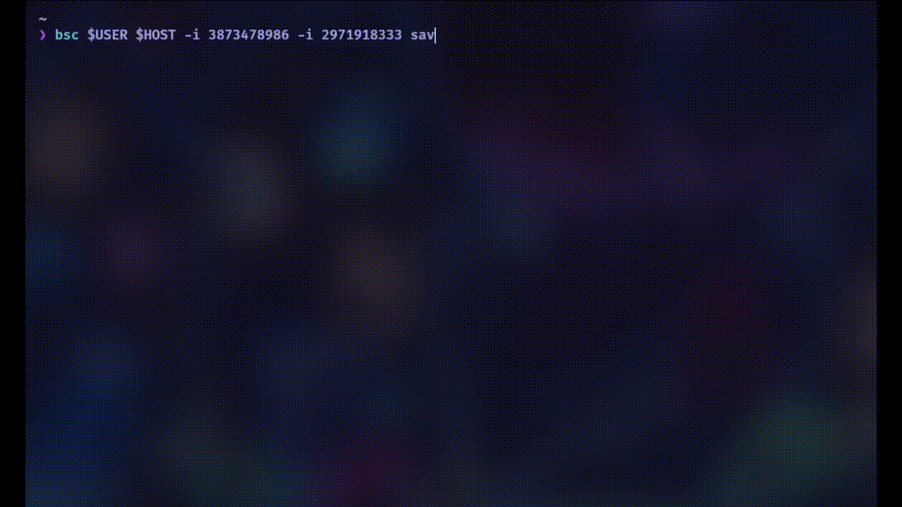

# Better Steam Cloud

A simple CLI utility to **backup** and **restore** Steam games save data over SSH.
Meant as a replacement to **Steam Cloud** for those who have a personal server at hand

I was tired of steam cloud deleting my save data, so I made my own with rust and ssh.

<p align="center">
  
</p>

## ✨ Features

- [x] Save or restore game saves
- [x] Target specific games by ID
- [x] Ignore selected games
- [x] Restore latest save automatically
- [x] Verbose mode
- [ ] Configuration file

## 🔧 Usage

```
Usage: bsc [OPTIONS] <USER> <HOST> <COMMAND>

Commands:
  save
  restore
```

### Global flags

- `-v`, `--verbose`: verbose output
- `-i <ID>`, `--ignore <ID>`: ignore game by ID (can be repeated)
- `-g <ID>`, `--game-id <ID>`: target a specific game
- `-l`, `--latest`: restore latest backup


### Save

```
Usage: bsc <USER> <HOST> save [OPTIONS]

Options:
  -g, --game-id <GAME_ID>
  -e, --exclude-patterns <EXCLUDE_PATTERNS>  List of patterns to skip
  -h, --help                                 Print help
```

#### Examples

- Backup all saves, ignoring some games:

  ```bash
  bsc alice 192.168.1.10 -i 730 -i 440 save
  ```

- Backup a specific game:

  ```bash
  bsc alice 192.168.1.10 save --game-id 1657630
  ```

- Backup a specific game, ignoring directories that match some patterns

  ```bash
  bsc alice 192.168.1.10 save --game-id 1657630 -e "LocalLow/*" -e "Roaming/Microsoft" -e "*/UnrealEngine"
  ```
> Note: The pattern matching syntax here is a somewhat clumsy glob matching that stops descending into matching directories.

### Restore

```
Usage: bsc <USER> <HOST> restore [OPTIONS]

Options:
  -l, --latest
  -g, --game-id <GAME_ID>
  -s, --hide-sizes
  -h, --help               Print help
```

- Restore the latest backup of all games:

  ```bash
  bsc alice 192.168.1.10 restore --latest
  ```

- Restore a specific game:

  ```bash
  bsc alice 192.168.1.10 restore --game-id 1657630
  ```

## 🔐 SSH Requirement

Ensure key-based SSH access is set up between your machine and the backup host.  
We use the SSH agent (ssh-agent or gpg-agent) to authenticate using your loaded private key. Ensure the `SSH_AUTH_SOCK` environment variable is set.

For fish:

```fish
eval (ssh-agent -c)
ssh-add ~/.ssh/id_rsa
```
